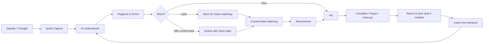
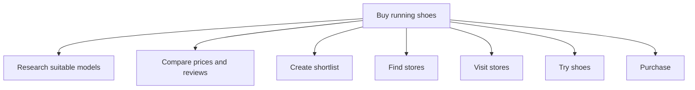
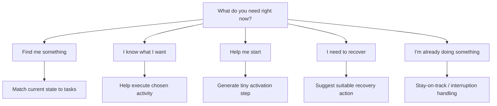
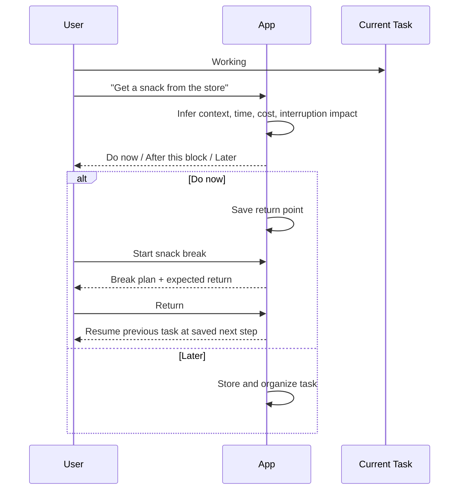
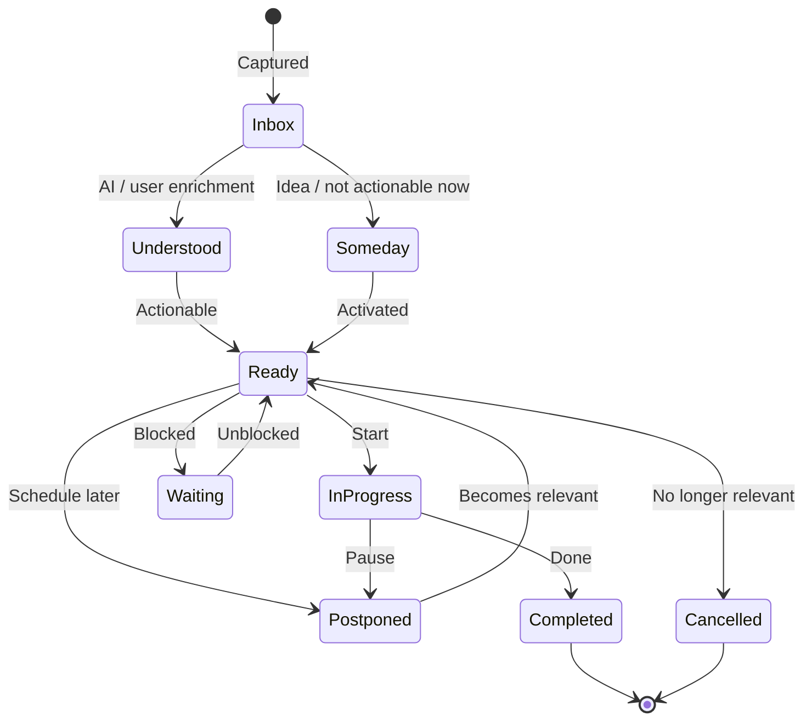
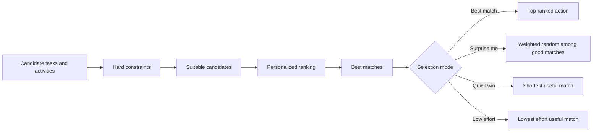
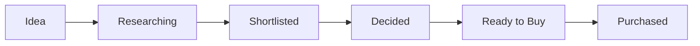
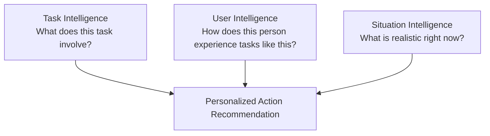

# Intelligent Personal Action App
## Product Requirements & Design Principles

**Status:** Consolidated product requirements  
**Purpose:** Define the product behavior, user experience principles, core data concepts, recommendation logic, and MVP scope for an intelligent personal action assistant.

---

## 1. Product Vision

The application is an **intelligent personal action assistant** that helps users capture thoughts and impulses as they occur, understand what those intentions require, organize them automatically, and surface the right action at the right moment.

The application is not primarily a conventional to-do list.

Its core loop is:

> **Impulse → Capture → Understand → Organize → Decide → Recommend → Act → Return → Learn**

The product should help users when they:

- know what they need to do;
- do not know what they want to do;
- want to do something specific;
- have an impulse while already working;
- have low energy or difficulty starting;
- need a recovery activity;
- want a comfort or leisure activity;
- need help returning to an interrupted task;
- want the app to remember ideas without turning every idea into an obligation.

---

# 2. Fundamental Design Principles

## 2.1 High intelligence internally, low effort externally

The system may contain complex internal engineering, including:

- AI-based metadata inference;
- task decomposition;
- task ranking;
- personalization;
- budget reasoning;
- behavioral learning;
- state-aware recommendation;
- task dependency modeling;
- recovery-effectiveness modeling;
- context matching.

However, the visible user experience must remain simple.

> **The user should not have to manage the intelligence.**

---

## 2.2 Ask as little as possible

The app should ask a question only when the answer:

1. cannot be inferred reliably enough; **and**
2. would materially affect how or when the task should be recommended.

Example:

**Buy toothpaste**

No follow-up is necessary.

**Buy a laptop**

The app may ask:

> Have you already decided which laptop you want?

because “already decided” and “needs research” represent very different tasks.

---

## 2.3 Infer first, let the user correct

The preferred interaction pattern is:

> **User provides minimal information → system estimates → user corrects only if necessary**

Do not require users to fill long forms for:

- effort;
- energy;
- location;
- category;
- focus;
- physicality;
- social requirement;
- time;
- cost type;
- task decomposition.

These should usually be inferred.

---

## 2.4 Progressive disclosure

Only the most useful information should be visible initially.

Example:

> **Estimated:** ~3 h · Medium energy · Medium focus · Outside · Paid · Splittable

Detailed metadata should be available through **Edit details**, not displayed as a large mandatory form.

---

## 2.5 Capture must be faster than acting on the distraction

A user should be able to record a thought in a few seconds.

The system should provide a persistent quick-capture entry point such as:

> **+ What's on your mind?**

The goal is to make this easier than immediately opening another app, website, shop, or browser tab.

---

## 2.6 Capturing does not mean committing

A thought may represent:

- an obligation;
- an idea;
- a someday activity;
- a purchase;
- a reusable comfort activity;
- a recovery activity;
- an immediate impulse.

The app should not convert every captured thought into an urgent to-do.

---

## 2.7 Support, not guilt

The product should avoid:

- guilt-inducing streaks;
- punitive language;
- excessive overdue warnings;
- pressure to optimize every minute;
- framing rest as failure.

The system should be useful even when the appropriate next action is recovery.

---

## 2.8 Personal behavior beats generic assumptions

Generic AI estimates are only an initial guess.

Over time, the system should learn:

> **How does this particular user experience this kind of task?**

For example:

- grocery shopping may be physically exhausting for one user;
- phone calls may require high social energy;
- cleaning may feel restorative;
- coding may be energizing or mentally draining;
- shopping may usually include lengthy research.

---

# 3. Core Product Flow



---

# 4. User Accounts, Privacy, and Personal Data

Users should be able to:

- create an account;
- log in;
- log out;
- keep their tasks and personal information private;
- view active tasks;
- view completed tasks;
- view postponed tasks;
- view cancelled tasks;
- view reusable activities;
- view task history;
- edit their tasks;
- delete their tasks;
- update account preferences;
- delete their personal data;
- view their activity and spending history.

The application should treat task content, behavioral data, mood/state inputs, and personal preferences as private user data.

---

# 5. Monthly Budget and Spending

Users should be able to define a **monthly budget**.

The system should support:

- monthly budget amount;
- actual spending;
- remaining budget;
- task-associated expenses;
- estimated future spending;
- planned purchases;
- spending by category;
- spending trends over time.

Example:

| Metric | Example |
|---|---:|
| Monthly budget | €800 |
| Spent | €470 |
| Remaining | €330 |
| Planned upcoming spending | €140 |

Budget information should influence recommendations.

Examples:

> Give me something free to do.

> I want to go out but spend less than €15.

> Show purchases I still want to make.

---

# 6. Universal Quick Capture

The application should provide a quick-capture field from major screens.

Examples:

- Buy running shoes.
- Get a snack from the store.
- Reply to Sarah.
- Watch Friends.
- Try this stretching video.
- Learn pottery someday.
- Clean the kitchen.
- Finish office report.
- Read this article: `<link>`

Quick capture should require **only the thought itself**.

The app should organize it later.

---

# 7. Task Creation

## 7.1 Primary input

### What do you want to do?

Example:

> Buy running shoes.

---

## 7.2 Execution-context input

### How do you want to do it?

Example:

> Research suitable models online, compare prices, then visit stores and try them before buying.

This field is important because the same title can represent very different workloads.

Example:

### User A
> Buy running shoes → I already know the model; order online.

Estimated result:

- 5–10 minutes;
- low effort;
- home;
- low physical effort.

### User B
> Buy running shoes → Research first, then visit stores and try options.

Estimated result:

- 2.5–4 hours;
- medium mental effort;
- medium physical effort;
- outside required;
- splittable.

The field should be optional for obvious/simple tasks.

---

# 8. Optional Task Inputs

The user may optionally provide:

- deadline;
- budget;
- exact price;
- duration;
- location;
- people involved;
- notes;
- URL;
- tutorial link;
- product link;
- map/location link;
- document;
- file;
- image;
- checklist;
- prerequisites;
- special constraints.

Optional inputs should not be required unless they are necessary for execution.

---

# 9. Rich Task Resources

A task/activity should be able to contain useful execution resources.

Examples:

- notes;
- URLs;
- YouTube tutorials;
- product pages;
- articles;
- recipes;
- maps;
- addresses;
- documents;
- files;
- images;
- checklists;
- contact information.

Example:

### 10-minute stretching routine

- **Tutorial:** YouTube link
- **Duration:** ~10 min
- **Useful when:** tired, stiff, restless
- **Location:** home
- **Energy required:** very low
- **Reusable:** yes

When this activity is recommended, the tutorial should be immediately accessible.

---

# 10. AI-Derived Metadata

The application should infer only metadata that is useful for task organization or recommendation.

Possible metadata:

- category;
- task/activity type;
- estimated duration;
- overall energy requirement;
- mental effort;
- physical effort;
- social effort;
- focus requirement;
- activation difficulty;
- cost type;
- estimated cost;
- location requirement;
- indoor/outdoor requirement;
- device requirement;
- person requirement;
- research required;
- planning required;
- flexibility;
- urgency;
- importance;
- enjoyment/stimulation level;
- reusable status;
- splittability;
- dependencies;
- time restrictions;
- likely after-effect;
- possible overuse risk;
- “good for” states.

The app should not display every inferred field by default.

---

# 11. Confidence and Metadata Provenance

AI estimates must not be treated as unquestionable facts.

Internally, metadata should support:

- value;
- source;
- confidence;
- user confirmation/correction.

Example:

```text
mental_effort:
  value: HIGH
  source: USER_CORRECTED
  confidence: 1.0
```

Possible sources:

- AI inferred;
- extracted directly from text;
- user provided;
- user confirmed;
- user corrected;
- learned from behavior.

User-corrected data should have higher priority than generic AI estimates.

---

# 12. Task / Activity Types

The system should support different internal entry types.

| Type | Example |
|---|---|
| One-time task | Submit tax form |
| Purchase | Buy running shoes |
| Errand | Buy groceries |
| Work task | Fix authentication bug |
| Reusable activity | Go for a walk |
| Routine | 10-minute stretching |
| Recovery activity | Take a short nap |
| Comfort activity | Watch Friends |
| Leisure activity | Watch a movie |
| Idea / Someday | Learn pottery |

The user should normally not have to select the type manually.

---

# 13. Reusable Activities

Not everything should disappear after completion.

Reusable examples:

- stretching;
- walking;
- showering;
- reading fiction;
- watching Friends;
- breathing exercise;
- making tea;
- going to the gym.

Reusable activities should remain in the user’s activity library and be recommended again when appropriate.

---

# 14. Intelligent Task Decomposition

The system should detect when a task contains multiple actionable stages.

Example:



### Critical UX rule

Task decomposition must **not create additional management burden**.

The app should:

- generate steps automatically;
- keep them hidden unless useful;
- allow the user to accept, edit, reject, or ignore them;
- surface only the actionable step that matters now.

---

# 15. Partial Task Recommendation

The app should be able to recommend a useful part of a larger task.

Example:

**Buy running shoes**  
Estimated total: ~3 hours

Current state:

- at home;
- 30 minutes available;
- medium focus.

Recommendation:

> **Research suitable running shoes for 30 minutes.**

The full parent task does not need to fit the current state if one actionable step does.

---

# 16. Minimum Useful Version

For larger tasks, the app should be able to derive a minimum useful action.

Example:

### Finish office report

Normal effort:

> ~90 minutes

Minimum useful version:

> Open the report, read the last section, and write the next three bullet points.

Estimated:

> ~10 minutes

This is particularly useful for low-energy or high-activation-difficulty situations.

---

# 17. Current-State Input

The state input should be as small as possible.

Core values:

### Energy
- Low
- Medium
- High

### Focus
- Low
- Medium
- High

### Social battery
- None / Very low
- Medium
- High

### Time available
- 5 minutes
- 15 minutes
- 30 minutes
- 1 hour
- 2+ hours

Optional:

### Spending
- Free only
- Spending okay

The system should reuse recent values when sensible rather than asking repeatedly.

---

# 18. Natural-Language State Input

Later versions should support state descriptions such as:

> I'm tired, don't want to talk to anyone, and have 20 minutes.

The app interprets this as:

- low energy;
- low social battery;
- max duration ~20 minutes.

Another example:

> I'm motivated and have two hours. Give me something important I've been avoiding.

---

# 19. Assistance Modes

The application should recognize that not every situation is a recommendation problem.



---

# 20. Mode: Find Me Something

Used when:

> I don't know what to do.

The system should:

1. collect minimal current-state information;
2. filter unsuitable tasks;
3. rank suitable tasks;
4. show a small number of recommendations, ideally one at a time.

---

# 21. Mode: I Know What I Want to Do

Used when:

> I want to clean.

The app should not recommend an unrelated activity.

It may offer:

- Just start;
- Give me a small starting step;
- Give me a plan.

---

# 22. Mode: Help Me Start

Used when:

> I have to work but I cannot get started.

The app should reduce activation difficulty.

Example:

Task:

> Finish office report.

Suggested first action:

> Open the document and read the last paragraph you worked on.

Then optionally:

> Work for five minutes.

The user should not be forced to commit to completing the whole task.

---

# 23. Mode: Recovery

Used when the user feels too tired to work effectively.

Possible recovery recommendations:

- water;
- short walk;
- stretching;
- short rest;
- short nap;
- shower;
- quiet time;
- change of environment.

The application should not diagnose medical conditions.

When appropriate, the best recommendation may be **recovery rather than another task**.

---

# 24. Recovery Activities

Recovery activities can be user-created.

Example:

### 10-minute stretching

- tutorial link;
- duration;
- low energy;
- low focus;
- home;
- reusable;
- good for stiffness/restlessness.

The system should preferentially recommend the user's own known recovery activities when appropriate.

---

# 25. Comfort Activities

Some activities primarily help the user relax.

Examples:

- watching Friends;
- listening to music;
- reading fiction;
- gaming;
- making tea.

Comfort activities may be useful even if they are not “productive.”

---

# 26. Overuse Risk

Some comfort activities may be hard to stop.

Example:

### Watch Friends

Possible internal metadata:

- relaxation: high;
- effort: very low;
- social effort: none;
- enjoyment: high;
- typical session: 1 episode;
- overuse risk: high.

The app should not automatically treat the most stimulating option as the best option.

---

# 27. Return After Comfort or Recovery Break

If a user takes a break while another task remains important, the app should help them return.

Example:

> Watch one episode of Friends (~22 min)

Afterward:

> Return to office task for 10 minutes.

The desired pattern is:

> **Work → intentional break → return bridge → work**

not:

> **Work → distraction → disappear**

---

# 28. Mode: Stay on Track

Used when the user is already doing something.

The app should support:

- active session tracking;
- runtime impulse capture;
- intentional breaks;
- temporary detours;
- return plans;
- re-entry into the previous task.

---

# 29. Runtime Impulse Capture

A user may think of another task while already working.

Example:

Current:

> Finish office feature.

New impulse:

> Get a snack from the store.

The app should allow immediate capture.

Possible choices:

- Do now.
- After this work block.
- Later.

---

# 30. Runtime Impulse Flow



---

# 31. Do-Now Tasks

If an impulse is suitable for immediate execution, the app should support doing it immediately.

Example:

> Take the trash downstairs.

The system may say:

> This looks like a ~5-minute task you can do now.

Actions:

- Do now.
- Save for later.

The app should not force every thought through a long planning process.

---

# 32. Active Sessions

The app should maintain an internal concept of a **session**.

A session may contain:

- current task;
- start time;
- current step;
- intended work duration;
- interruptions;
- breaks;
- next action;
- saved resume point.

Sessions make return-to-task behavior possible.

---

# 33. Return-to-Task Bridge

When a task is interrupted, the system should save:

- what the user was doing;
- where they stopped;
- what the next action is.

Example:

> You were working on **Finish office feature**.

> Next step: **Finish input validation.**

Actions:

- Continue.
- I need another 5 minutes.
- Change plan.

---

# 34. Intentional Breaks

A break should be allowed to become part of the plan.

Example:

> Snack break — ~20 min.

Afterward:

> Return to **Finish office feature**.

The app should support user choice without treating every break as task abandonment.

---

# 35. Task Lifecycle



Suggested internal states:

- Inbox;
- Understood;
- Ready;
- In progress;
- Waiting;
- Someday;
- Postponed;
- Completed;
- Cancelled.

---

# 36. Recommendation Pipeline

Recommendation should use two stages.



---

# 37. Hard Filtering

Tasks may be eliminated based on:

- available time;
- current location;
- current budget;
- free-only preference;
- required device;
- required person;
- incomplete dependency;
- task status;
- time restrictions;
- store/business availability where known;
- impossible current context.

---

# 38. Personalized Ranking

Remaining tasks may be ranked using:

- energy match;
- focus match;
- social-energy match;
- importance;
- urgency;
- deadline;
- time neglected;
- activation difficulty;
- enjoyment;
- historical acceptance;
- historical completion;
- recovery effectiveness;
- current context;
- personal preferences;
- likely after-effect.

---

# 39. Recommendation Modes

The app may support:

### Best Match
Best overall action.

### Surprise Me
Weighted random selection among suitable actions.

### Quick Win
Short useful task.

### Important
Important suitable task.

### Low Effort
Useful option requiring minimal effort.

### Something Fun
Enjoyable appropriate activity.

### Clear Backlog
Older neglected task.

### Use My Energy
Demanding but valuable task suited to current capacity.

### Budget-Conscious
Free or inexpensive activity.

---

# 40. One Recommendation at a Time

The app should avoid overwhelming the user with long lists.

Example:

### Research running shoes

Part of: **Buy running shoes**

- ~30 min
- medium focus
- home
- no social interaction
- free

Recommended because it matches the user's current state.

Actions:

- Start.
- Another one.
- Not now.

---

# 41. Recommendation Explanation

The app should provide concise reasons where useful.

Example:

> Recommended because:
> - you have 30 minutes;
> - you are at home;
> - it requires little social interaction;
> - you have postponed it several times.

This improves user trust.

---

# 42. Lightweight Feedback

Possible feedback:

- Good suggestion.
- Not now.
- Too tiring.
- Takes longer.
- Too expensive.
- Cannot do it here.
- Do not feel like it.

Feedback should require only one or two taps.

---

# 43. Implicit Learning

The app should learn from:

- recommendations accepted;
- recommendations skipped;
- tasks postponed;
- actual completion time;
- metadata corrections;
- repeated activity choices;
- recovery outcomes;
- interruptions;
- return success;
- abandoned activities;
- overuse patterns;
- preferred times of day.

The user should not have to explicitly train the model.

---

# 44. Personalization

Over time, the app should build a personal task-effort model.

Example:

```text
For this user:

shopping -> often includes research
grocery shopping -> high physical effort
phone calls -> high social effort
coding -> high mental focus
cleaning -> often relaxing
Friends -> high relaxation + high continuation risk
short walk -> frequently improves low-energy states
```

Personal history should eventually outweigh generic assumptions.

---

# 45. “Good For” Metadata

Reusable activities may contain useful-state metadata.

Examples:

### Short walk

Good for:

- low energy;
- restlessness;
- mental fatigue;
- needing fresh air.

### Stretching

Good for:

- stiffness;
- restlessness;
- long periods of sitting.

This can initially be AI-inferred and later personalized.

---

# 46. Recovery Effectiveness

The application should learn whether recovery activities actually help.

Example:

Before:

> Very tired.

Action:

> 10-minute stretching.

After:

> Feeling better?

- Yes.
- A little.
- No.

Over time, the app should identify which recovery strategies are useful for the individual user.

---

# 47. After-Effect Modeling

Some activities affect the user's later capacity.

Examples:

| Activity | Immediate effect | Possible after-effect |
|---|---|---|
| Short walk | Moderate effort | More alert |
| Stretching | Relaxing | Less restless |
| Short nap | Rest | More alert or groggy |
| Social event | Enjoyable | Lower social battery |
| Friends episode | Relaxing | Risk of continuing |
| Cleaning | Moderate effort | Satisfaction / fatigue |

Recommendations may eventually consider both immediate suitability and likely after-effect.

---

# 48. Activation Difficulty

Task difficulty is not equal to duration.

Example:

> Reply to email.

Duration:

> ~10 minutes.

Activation difficulty:

> High.

The app may recommend:

> Open the email and read it.

as the first step.

---

# 49. Task Dependencies and Blocking

Tasks may depend on other tasks.

Examples:

### Book flight
Requires:

> Vacation approval.

### Visit shoe store
Requires:

> Shortlist shoe models.

Blocked tasks should not be recommended as actionable.

---

# 50. Context Constraints

Tasks may include conditions such as:

- requires home;
- requires office;
- requires outside;
- requires laptop;
- requires phone;
- requires another person;
- requires store to be open;
- weekday only;
- evening only;
- not before a certain date.

The system should infer these where possible.

---

# 51. Someday / Maybe

Not every thought should become active work.

Example:

> Maybe learn pottery.

This may be stored as:

> **Someday / Maybe**

Later, when the user says:

> I have a free Saturday and want to do something interesting.

the app can surface it.

---

# 52. Purchase Tasks

Purchase tasks may have specialized information:

- expected budget;
- actual cost;
- research required;
- shortlisted products;
- product links;
- purchase priority;
- need vs want;
- store/location;
- purchase stage.

Possible purchase lifecycle:



---

# 53. Personal Activity Library

The system should gradually maintain reusable activities.

Example:

### Very tired
- stretch;
- shower;
- nap;
- walk;
- tea;
- one Friends episode.

### Low focus
- laundry;
- organize desk;
- simple admin work.

### High focus
- programming;
- writing;
- difficult reading.

The system should learn these patterns rather than requiring manual lists.

---

# 54. Search and Querying

Users should also be able to browse tasks directly.

Examples:

> Show all Career tasks.

> Show free things I can do in 20 minutes.

> Show activities requiring no social interaction.

> Show purchases I still want to make.

Later:

> What cheap outdoor activities have I been meaning to do?

---

# 55. Dashboard

The dashboard should be useful but not overwhelming.

Possible sections:

## Today

- tasks completed;
- activities completed;
- recovery activities;
- spending.

## Budget

- monthly budget;
- spent;
- remaining;
- planned spending.

## Patterns

- useful times of day;
- activities that often help when tired;
- activities frequently skipped;
- common task-effort patterns.

## Backlog

- active;
- waiting;
- someday;
- purchases.

---

# 56. Daily Reflection

Optional and lightweight.

Example:

### What helped today?

- Walk
- Nap
- Cleaning
- Friends
- Short work blocks

### What made today harder?

- Poor sleep
- Interruptions
- Low energy
- Task too large

This should require only a few taps.

---

# 57. Core Intelligence Layers

The product ultimately needs three forms of intelligence.



---

# 58. Product Promise

The application should become an external memory and action system the user can trust.

When a thought occurs:

> I should look at new headphones.

The user should not have to choose between:

1. acting on it immediately and becoming distracted; or
2. ignoring it and worrying about forgetting it.

Instead:

> **Capture it in a few seconds.**

The system should remember it, understand it, organize it, and bring it back when appropriate.

---

# 59. MVP Scope

The MVP should implement the core product loop without attempting all advanced intelligence immediately.

## Required for MVP

1. Account registration and login.
2. Private user data.
3. Universal quick capture.
4. Task title.
5. Optional “How do you want to do this?” input.
6. Notes and links.
7. Basic AI metadata inference.
8. Metadata correction.
9. Basic task decomposition.
10. One-time tasks and reusable activities.
11. Current-state input:
   - energy;
   - focus;
   - social battery;
   - available time.
12. Basic recommendation filtering.
13. Basic recommendation ranking.
14. Best Match.
15. Surprise Me.
16. Do Now / Later.
17. Active session.
18. Runtime impulse capture.
19. Return-to-task bridge.
20. Recovery activities.
21. Lightweight feedback.
22. Task history.
23. Monthly budget.
24. Expense tracking.
25. Simple budget dashboard.

---

# 60. Later Intelligent Features

After the MVP is stable:

- natural-language state queries;
- stronger personalization;
- implicit behavioral learning;
- recovery-effectiveness modeling;
- after-effect prediction;
- advanced task decomposition;
- activation-difficulty learning;
- context-aware recommendations;
- calendar integration;
- richer time-awareness;
- location-aware context where appropriate;
- richer attachments;
- personal routine discovery;
- spending analytics;
- “good for” activity learning;
- better recommendation explanations;
- behavioral pattern discovery.

---

# 61. Non-Goals for the First Version

The first version should **not** become:

- a complex project-management suite;
- a social network;
- a habit-streak game;
- a medical diagnosis tool;
- a full personal finance platform;
- a calendar replacement;
- an app that requires the user to manually maintain dozens of tags.

These may distract from the main problem:

> **Capture thoughts quickly, reduce distraction, organize automatically, and help the user choose or resume an appropriate action.**

---

# 62. Final UX Rule

A useful decision rule for every future feature:

> **If the system can reasonably infer it, do not ask the user to enter it.**

And:

> **If a feature adds more mental load than the problem it solves, redesign or remove it.**

The internal system can be sophisticated.

The user experience should feel simple:

1. **Capture what came to mind.**
2. **Tell the app very little.**
3. **Let the app understand and organize it.**
4. **Get help doing the right thing when the moment comes.**
