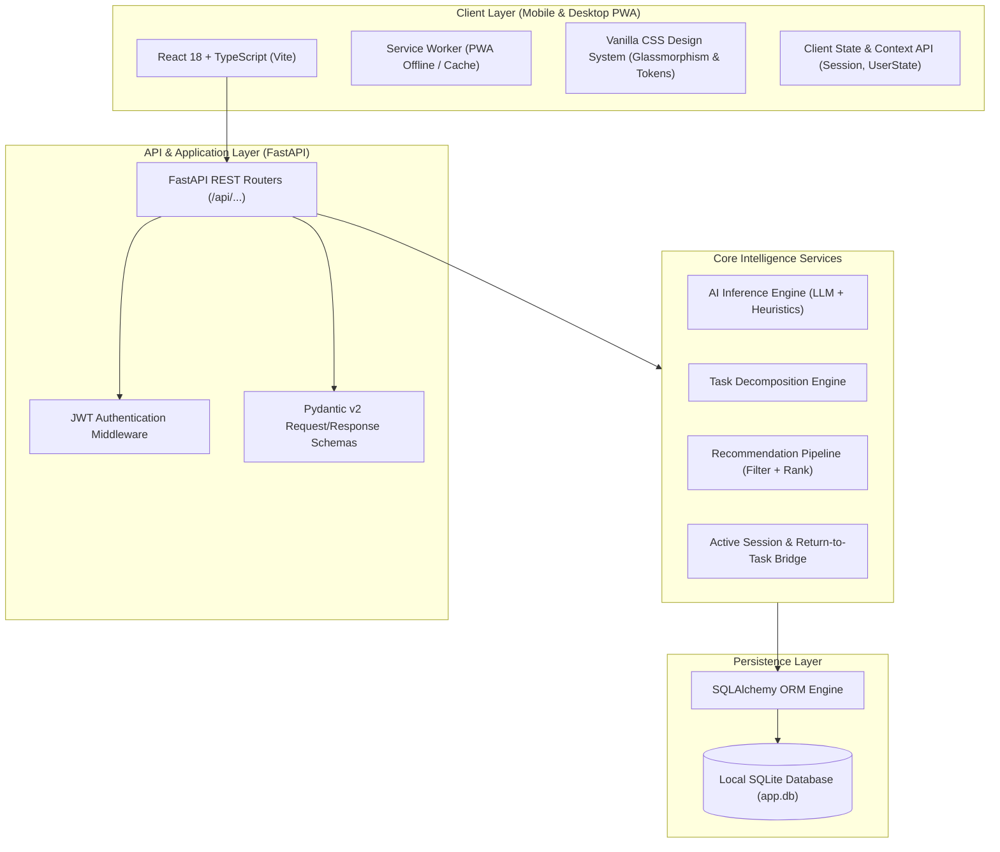
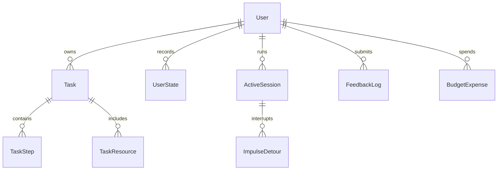
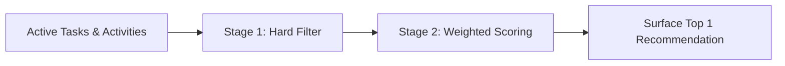

# Intelligent Personal Action App — Technical Specifications

**Version:** 1.0.0  
**Status:** Approved Architecture & Specification  
**Author:** AI Architecture Team & Iqra Malik  
**Repository:** `intelligent-personal-action-app`

---

## 1. System Overview & Architectural Principles

The **Intelligent Personal Action App** is a personal action assistant engineered to minimize friction between thought impulse and capture, while maximizing intelligent context-aware execution.

### Architectural Tenets
1. **Zero Global Dependencies**: All dependencies are isolated strictly within project-local directories (`backend/.venv` for Python, `frontend/node_modules` for Node/React).
2. **Cross-Platform Ubiquity (Mobile-First PWA)**: Designed primarily for one-handed mobile touch interactions (via Progressive Web App installation), with seamless adaptation to desktop/laptop environments (keyboard shortcuts, multi-column layouts).
3. **Dual AI Strategy**:
   - **Primary**: Structured LLM API integration (Gemini / OpenAI compatible) returning validated JSON.
   - **Fallback**: Local deterministic heuristics engine ensuring 100% offline capability and zero-cost local testing.
4. **Embedded Zero-Config Storage**: Single-file SQLite database via SQLAlchemy ORM, requiring no external database server daemon.

---

## 2. System Architecture



---

## 3. Technology Stack & Isolation Strategy

| Tier | Technology | Rationale | Isolation Guarantee |
| :--- | :--- | :--- | :--- |
| **Backend** | **Python 3.10+ / FastAPI** | Asynchronous, fast, auto-generates OpenAPI docs, premier ecosystem for AI & scoring logic. | Local `.venv` in `backend/` |
| **Database** | **SQLite + SQLAlchemy 2.0** | Embedded single file (`backend/data/app.db`), zero daemon setup, ACID compliant, easily backed up. | Single file in project root |
| **Frontend** | **React 18 + TypeScript + Vite** | Sub-second HMR, lightweight bundle size, strict type safety. | Local `node_modules` in `frontend/` |
| **Styling** | **Vanilla CSS Design System** | Maximum performance, CSS variables, mobile touch-tuned tokens, zero heavyweight frameworks. | Compiled by Vite |
| **Mobile/PWA** | **vite-plugin-pwa** | Enables "Add to Home Screen" on iOS and Android with offline asset caching. | Managed in `package.json` |
| **Validation** | **Pydantic v2** | High-speed data serialization and schema enforcement. | Managed in `requirements.txt` |

---

## 4. Data Models & Database Schema

All tables inherit standard timestamps (`created_at`, `updated_at`) and soft deletion (`is_deleted`).



### 4.1 `users`
| Column | Type | Constraints | Description |
| :--- | :--- | :--- | :--- |
| `id` | Integer | PK, Auto | Unique User Identifier |
| `email` | String(255) | Unique, Indexed | User login email |
| `hashed_password` | String(255) | Not Null | Argon2 / bcrypt password hash |
| `monthly_budget` | Float | Default: 0.0 | User-defined monthly spending cap |
| `currency` | String(10) | Default: "EUR" | Preferred currency symbol |
| `preferences` | JSON | Nullable | Custom energy patterns and recovery favorites |

### 4.2 `tasks`
| Column | Type | Constraints | Description |
| :--- | :--- | :--- | :--- |
| `id` | Integer | PK, Auto | Primary Key |
| `user_id` | Integer | FK -> users.id | Owner ID |
| `title` | String(500) | Not Null | Primary captured thought or task name |
| `execution_context` | Text | Nullable | "How do you want to do it?" context |
| `status` | Enum | Default: 'INBOX' | `INBOX`, `UNDERSTOOD`, `READY`, `IN_PROGRESS`, `WAITING`, `SOMEDAY`, `POSTPONED`, `COMPLETED`, `CANCELLED` |
| `task_type` | Enum | Default: 'ONE_TIME' | `ONE_TIME`, `PURCHASE`, `ERRAND`, `WORK`, `REUSABLE`, `ROUTINE`, `RECOVERY`, `COMFORT`, `LEISURE`, `SOMEDAY` |
| `estimated_duration` | Integer | Nullable | Estimated time in minutes |
| `energy_level` | Enum | Default: 'MEDIUM' | `LOW`, `MEDIUM`, `HIGH` |
| `focus_level` | Enum | Default: 'MEDIUM' | `LOW`, `MEDIUM`, `HIGH` |
| `social_level` | Enum | Default: 'NONE' | `NONE`, `LOW`, `MEDIUM`, `HIGH` |
| `activation_difficulty`| Enum | Default: 'MEDIUM' | `LOW`, `MEDIUM`, `HIGH` |
| `cost_type` | Enum | Default: 'FREE' | `FREE`, `PAID` |
| `estimated_cost` | Float | Default: 0.0 | Projected cost in user currency |
| `location_requirement`| Enum | Default: 'ANY' | `HOME`, `OFFICE`, `OUTSIDE`, `SPECIFIC_STORE`, `ANY` |
| `device_requirement` | Enum | Default: 'NONE' | `PHONE`, `LAPTOP`, `ANY`, `NONE` |
| `is_reusable` | Boolean | Default: False | True for recurring self-care/recovery activities |
| `splittable` | Boolean | Default: False | If sub-tasks can be executed independently |
| `overuse_risk` | Enum | Default: 'LOW' | `LOW`, `MEDIUM`, `HIGH` (e.g. streaming, gaming) |
| `good_for` | JSON | Nullable | List of states task remedies (e.g. ["tired", "stiff", "restless"]) |
| `provenance` | JSON | Nullable | Metadata source tracking (`AI_INFERRED`, `USER_SET`, etc.) |

### 4.3 `task_steps` (Decomposition)
| Column | Type | Constraints | Description |
| :--- | :--- | :--- | :--- |
| `id` | Integer | PK, Auto | Step Identifier |
| `task_id` | Integer | FK -> tasks.id | Parent Task |
| `title` | String(255) | Not Null | Actionable step description |
| `order` | Integer | Not Null | Execution order index |
| `is_completed` | Boolean | Default: False | Step completion flag |
| `estimated_duration` | Integer | Default: 5 | Minutes required for this step |
| `is_minimum_useful` | Boolean | Default: False | True if this is the tiny activation step |

### 4.4 `active_sessions` & `impulse_detours`
Tracks the current running task, intentional breaks, and distraction bridges:
* **`active_sessions`**: `id`, `user_id`, `task_id`, `started_at`, `paused_at`, `resume_step_id`, `return_note`, `status` (`ACTIVE`, `PAUSED`, `COMPLETED`).
* **`impulse_detours`**: `id`, `session_id`, `impulse_task_id`, `route_action` (`DO_NOW`, `AFTER_BLOCK`, `LATER`), `started_at`, `completed_at`.

### 4.5 `user_states` (Current Capacity Snapshots)
* Fields: `id`, `user_id`, `energy` (`LOW`/`MEDIUM`/`HIGH`), `focus` (`LOW`/`MEDIUM`/`HIGH`), `social_battery` (`LOW`/`MEDIUM`/`HIGH`), `available_time` (minutes), `spending_allowed` (boolean), `recorded_at`.

---

## 5. Core Intelligence & Algorithms

### 5.1 AI Metadata Inference Engine
When a raw thought is captured via Universal Quick Capture:
1. **Prompt Structure**:
   ```json
   {
     "thought": "Buy running shoes",
     "context": "Already picked model, need to order online"
   }
   ```
2. **Inference Output**:
   ```json
   {
     "category": "PURCHASE",
     "task_type": "PURCHASE",
     "estimated_duration": 10,
     "energy_level": "LOW",
     "focus_level": "LOW",
     "social_level": "NONE",
     "activation_difficulty": "LOW",
     "cost_type": "PAID",
     "estimated_cost": 120.0,
     "location_requirement": "HOME",
     "device_requirement": "PHONE",
     "splittable": false,
     "minimum_useful_step": "Open browser tab to product link"
   }
   ```
3. **Deterministic Fallback**:
   If no API key is provided or the device is offline, regex heuristics match key tokens (`buy`, `stretching`, `walk`, `clean`, `report`) to sensible baseline defaults.

### 5.2 Recommendation Pipeline

The recommendation engine executes two distinct stages:



#### Stage 1: Hard Constraints Elimination
A task is disqualified if:
* $\text{estimated\_duration} > \text{available\_time}$
* $\text{location\_requirement} \neq \text{current\_location}$ (when specified)
* $\text{cost\_type} == \text{'PAID'}$ and $\text{spending\_allowed} == \text{False}$
* Task has incomplete prerequisite dependencies (`is_blocked == True`)

#### Stage 2: Scoring Formula
Each remaining task $T$ is assigned a suitability score $S(T) \in [0, 100]$:
$$S(T) = w_E \cdot M(E_U, E_T) + w_F \cdot M(F_U, F_T) + w_S \cdot M(S_U, S_T) + w_U \cdot U_T + w_N \cdot N_T - w_A \cdot A_T$$

Where:
* $M(x_U, x_T)$: Capacity match score (1.0 for exact match, 0.5 for capacity headroom, 0.1 for overload).
* $U_T$: Urgency/deadline factor $[0, 1]$.
* $N_T$: Neglect factor (boosts tasks postponed multiple times).
* $A_T$: Activation penalty (penalizes high-activation tasks when user energy is low).

---

## 6. REST API Endpoints Specification

### Authentication (`/api/auth`)
* `POST /api/auth/register` — Create account.
* `POST /api/auth/token` — OAuth2 Password Request / JWT issue.
* `GET /api/auth/me` — Current user profile & budget stats.

### Quick Capture & Tasks (`/api/tasks`)
* `POST /api/tasks/quick-capture` — Sub-second thought submission with background AI enrichment.
* `GET /api/tasks` — List tasks with query filters (`status`, `type`, `location`).
* `GET /api/tasks/{id}` — Task details with progressive disclosure metadata.
* `PATCH /api/tasks/{id}` — Edit details / user corrections.
* `POST /api/tasks/{id}/decompose` — Trigger step breakdown.

### Recommendations (`/api/recommendations`)
* `POST /api/recommendations/next` — Submit current state and receive top recommendation.
  - Modes supported: `BEST_MATCH`, `SURPRISE_ME`, `QUICK_WIN`, `LOW_EFFORT`, `RECOVERY`.
* `POST /api/recommendations/feedback` — Submit 1-tap feedback (`ACCEPTED`, `NOT_NOW`, `TOO_TIRING`, `TAKES_LONGER`).

### Active Sessions & Return Bridge (`/api/sessions`)
* `POST /api/sessions/start` — Begin work session on task $T$.
* `POST /api/sessions/impulse` — Route unexpected impulse (`DO_NOW`, `AFTER_BLOCK`, `LATER`).
* `POST /api/sessions/pause` — Save return checkpoint and initiate intentional break.
* `GET /api/sessions/active` — Fetch active session status and return bridge info.
* `POST /api/sessions/resume` — Return from break/impulse to previous task.

### Activities & Recovery (`/api/activities`)
* `GET /api/activities/recovery` — List user's instant recovery activities (stretching, walk, nap).
* `POST /api/activities` — Save reusable self-care or comfort activity.

### Budget (`/api/budget`)
* `GET /api/budget/summary` — Monthly cap, spent, remaining, planned purchases.
* `POST /api/budget/expenses` — Log task-associated expense.

---

## 7. Frontend UI / UX Specification

### Mobile Ergonomics (Phone First)
* **Bottom Navigation Bar**: 4 key views:
  1. **Now (Recommendations & Active Session)**
  2. **Library (Tasks & Someday)**
  3. **Care (Recovery & Reusable Activities)**
  4. **Budget (Spending & Purchases)**
* **Thumb-Zone Capture Button**: Floating `+` action button docked at bottom-right for instant 1-tap thumb capture.
* **Quick-Capture Drawer**: Opens from bottom, auto-focuses text input, dismisses on submit with subtle haptic vibration / toast confirmation.
* **Single-Card Recommendation Display**: Shows *one* clear action with high-contrast metadata pills and 3 simple options:
  - `[ Start Now ]`
  - `[ Another One ]`
  - `[ Smallest Step ]` (Activation mode)

### Desktop Adaptations (Laptop)
* **Keyboard Shortcut**: `Cmd / Ctrl + K` triggers universal quick capture from anywhere in the app.
* **Two-Pane Layout**: Active recommendation / session on the left; upcoming queue & budget summary on the right.

---

## 8. Directory Layout

```text
intelligent-personal-action-app/
├── .gitignore
├── README.md
├── TECHNICAL_SPECIFICATIONS.md        # <-- This Document
│
├── backend/                            # Isolated Python Service
│   ├── .venv/                          # Local Python Environment
│   ├── requirements.txt
│   ├── .env.example
│   ├── app/
│   │   ├── main.py
│   │   ├── config.py
│   │   ├── database/
│   │   │   ├── session.py
│   │   │   └── base.py
│   │   ├── models/                     # SQLAlchemy Models
│   │   ├── schemas/                    # Pydantic Schemas
│   │   ├── services/                   # AI & Business Logic
│   │   └── routers/                    # FastAPI Endpoints
│   └── tests/
│
└── frontend/                           # Isolated Vite + React PWA
    ├── package.json
    ├── vite.config.ts
    ├── tsconfig.json
    ├── public/
    │   ├── manifest.json
    │   └── icons/
    └── src/
        ├── index.css                   # Design Tokens & Responsive Layout
        ├── main.tsx
        ├── App.tsx
        ├── api/                        # Typed Client
        ├── components/                 # Atomic UI Components
        ├── hooks/                      # Custom React Hooks
        └── types/                      # Shared TS Interfaces
```

---

## 9. Isolated Execution Commands (Step-by-Step)

### Backend (Isolated in `backend/.venv`)
```powershell
# 1. Enter backend directory
cd backend

# 2. Create isolated virtual environment
python -m venv .venv

# 3. Activate virtual environment (PowerShell)
.\.venv\Scripts\Activate.ps1

# 4. Install backend dependencies locally
pip install -r requirements.txt

# 5. Run development server on port 8000
uvicorn app.main:app --reload --port 8000
```

### Frontend (Isolated in `frontend/node_modules`)
```powershell
# 1. Enter frontend directory
cd frontend

# 2. Install dependencies locally (no global packages)
npm install

# 3. Run development server (accessible from phone via Wi-Fi)
npm run dev -- --host
```
